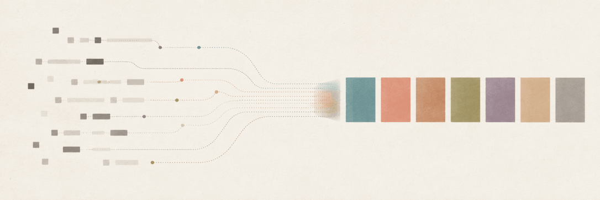

# okhash

<p align="center">
  
</p>

Deterministic string-to-color generator built on OKLCH.

Give okhash a string, get a color. The same string and options always produce
the same color, on every runtime and every release. Colors are chosen in OKLCH,
so a set of them reads as perceptually even rather than lurching between bright
and muddy.

**[Live demo and playground →](https://bityoungjae.github.io/okhash/)**

```ts
import { hashColor } from "okhash";

hashColor.hex("Alice"); // "#a293cb"
hashColor.css("Alice"); // "oklch(0.696651 0.082351 296.496)"
```

- ESM-only, zero runtime dependencies.
- Core entry ~6.7 KB gzip, palette subpath ~0.8 KB gzip (measured, see [Verifying the numbers](#verifying-the-numbers)).
- Uses only ECMA-262, so output matches across Node, Deno, Bun, workers, and browsers.

## Install

```sh
npm i okhash
```

Requires Node 22.22.1 or newer. The package ships a single ESM build; `require()`
works on Node versions that support `require(esm)`.

## Browser CDN

For pages without a build step, import okhash from an ESM CDN:

```html
<script type="module">
  import { hashColor } from "https://esm.sh/okhash@1";

  const color = hashColor("Alice");
  document.body.style.setProperty("--accent", color.hex());
</script>
```

The palette subpath works the same way:

```html
<script type="module">
  import { paletteFrom } from "https://esm.sh/okhash@1/palette";

  const colors = paletteFrom("acme-corp", 5).map((color) => color.hex());
</script>
```

Use an exact version such as `okhash@1.0.4` when you need a fully pinned page.

## Quick start

```ts
import { createColorHash, hashColor } from "okhash";

// Module singleton with default options.
hashColor.hex("Alice"); // "#a293cb"
hashColor.rgb("Alice"); // [162, 147, 203]
hashColor.oklch("Alice"); // { l: 0.696651…, c: 0.082351…, h: 296.496… }
hashColor.css("Alice"); // "oklch(0.696651 0.082351 296.496)"

// A configured instance.
const colorize = createColorHash({ mood: "vibrant", seed: 0xc0ffee });
const color = colorize("user@acme.io");
color.hex(); // "#6a60db"
color.foreground(); // "#000000" or "#ffffff", whichever reads better
color.variant("dark"); // same identity, tuned for a dark surface
```

`hashColor` is a ready-made instance with default options. Call
`createColorHash(options)` when you want a different mood, seed, or surface.

## How it works

Each call runs a small fixed pipeline:

1. Hash the string with cyrb53 into two 32-bit words.
2. Slice those bits into three independent samples for hue, chroma, and lightness.
3. Map each sample through its channel spec into an OKLCH coordinate.
4. Apply a Helmholtz-Kohlrausch lightness correction so saturated blues and
   violets stop reading as brighter than they measure.
5. Convert OKLCH to sRGB and quantize to an 8-bit `(R, G, B)` triplet.

That triplet is the canonical color. `hex()`, `rgb()`, `oklch()`, and `css()`
are all pure functions of it, so they never disagree. Parsing the `css()` string
back to sRGB returns the same triplet.

The full normative algorithm, including every constant, lives in
[docs/REFERENCE.md](docs/REFERENCE.md).

## API

### `createColorHash(options?)`

Returns a `colorize` function. The returned function carries direct-path methods
for when you only need one format:

```ts
const colorize = createColorHash();

colorize("Alice"); // Color object (formats are computed lazily and memoized)
colorize.hex("Alice"); // string, no Color allocation
colorize.rgb("Alice"); // readonly [number, number, number]
colorize.oklch("Alice"); // { l, c, h }
colorize.css("Alice"); // string
```

Passing a non-string throws `TypeError`. Invalid options throw at construction
time (`TypeError` for wrong types, `RangeError` for out-of-domain values), so the
call path itself only validates its string input.

#### Options

| Option      | Type                                                                  | Default      | Notes                                             |
| ----------- | --------------------------------------------------------------------- | ------------ | ------------------------------------------------- |
| `mood`      | `"balanced" \| "pastel" \| "vibrant" \| "jewel" \| "earth" \| "neon"` | `"balanced"` | Named bundle of channel specs and weights.        |
| `hue`       | `ChannelSpec`                                                         | mood value   | Overrides the mood's hue.                         |
| `lightness` | `ChannelSpec`                                                         | mood value   | OKLCH L in `[0, 1]`.                              |
| `chroma`    | `ChromaSpec \| { mode, range }`                                       | mood value   | See [Chroma modes](#chroma-modes).                |
| `hk`        | `boolean`                                                             | mood value   | Helmholtz-Kohlrausch correction.                  |
| `surface`   | `"light" \| "dark"`                                                   | `"light"`    | Applies the dark-surface variant to every output. |
| `cvdSafe`   | `boolean`                                                             | `false`      | Color-vision-safe channel preset.                 |
| `seed`      | `number` (uint32)                                                     | `0`          | Gives an app its own color space.                 |
| `normalize` | `"NFC" \| false`                                                      | `false`      | Unicode normalization before hashing.             |
| `cache`     | `number`                                                              | `256`        | Bounded FIFO cache size. `0` disables it.         |

#### ChannelSpec

`hue`, `lightness`, and `chroma` accept the same shapes:

| Shape          | Meaning                           | Example                                               |
| -------------- | --------------------------------- | ----------------------------------------------------- |
| `number`       | Constant                          | `lightness: 0.65`                                     |
| `number[]`     | Discrete choices, even weight     | `hue: [30, 200, 320]`                                 |
| `{ min, max }` | Continuous uniform range          | `lightness: { min: 0.6, max: 0.75 }`                  |
| `Range[]`      | Several ranges, weighted by width | `hue: [{ min: 200, max: 260 }, { min: 20, max: 50 }]` |

`hue` ranges may wrap past 0: `{ min: 330, max: 30 }` is a 60-degree arc through
red. Non-hue ranges require `min <= max`.

```ts
// Steer channels directly; explicit channels override the mood.
createColorHash({
  hue: [{ min: 200, max: 260 }], // brand blues only
  lightness: { min: 0.62, max: 0.7 },
  chroma: { mode: "relative", range: { min: 0.7, max: 0.9 } },
});
```

#### Chroma modes

Chroma has two modes that trade set evenness against per-color vividness:

- `uniform` (default for most moods): chroma is an absolute OKLCH value, capped
  at the largest chroma every hue can reach at that lightness. A set stays even
  because no hue outshines the others.
- `relative`: chroma is a fraction of each hue's own gamut limit. Each color
  reaches its own ceiling, so individual colors look punchier while perceived
  saturation varies across hues.

```ts
createColorHash({ chroma: { min: 0.05, max: 0.1 } }); // uniform
createColorHash({ chroma: { mode: "relative", range: { min: 0.7, max: 0.95 } } });
```

In `uniform` mode a number ceiling is an intent, not a guarantee: at some
lightnesses the gamut cap is lower, so the actual chroma can land below the
ceiling you asked for. This is by design and keeps every output in sRGB.

### Moods

A mood is a named combination of channel specs, chroma mode, and hue weighting.

| Mood       | Character                                   |
| ---------- | ------------------------------------------- |
| `balanced` | Default. Uniform chroma, even across a set. |
| `pastel`   | High lightness, low chroma.                 |
| `vibrant`  | Relative chroma, punchy.                    |
| `jewel`    | Deep, darker lightness.                     |
| `earth`    | Warm-weighted hues, muted chroma.           |
| `neon`     | Maximum relative chroma.                    |

```ts
createColorHash({ mood: "pastel" }).hex("design"); // "#e1bbc6"
```

### The `Color` object

```ts
interface Color {
  hex(): string; // "#a293cb"
  rgb(): readonly [number, number, number]; // [162, 147, 203]
  oklch(): { l: number; c: number; h: number };
  css(): string; // "oklch(0.696651 0.082351 296.496)"
  foreground(options?: ForegroundOptions): string;
  variant(surface: "light" | "dark"): Color;
}
```

`oklch()` returns the OKLCH coordinate of the canonical triplet, the same value
`css()` prints. Building a CSS string yourself from `oklch()` gives you exactly
what `css()` returns and the same color as `hex()`.

#### `foreground(options?)`

Picks a readable text color for the background.

```ts
const c = hashColor("Alice Park");
c.foreground(); // "#000000" — default metric, perceptual lightness difference
c.foreground({ metric: "wcag2" }); // WCAG 2 contrast ratio, for compliance contexts
c.foreground({ candidates: ["#1a1a1a", "#f5f5f5"] }); // your own candidate set
c.foreground({ rank: myApcaRanker }); // plug in any contrast function
```

The default `"auto"` metric maximizes the OKLab lightness difference between
background and candidate. okhash does not bundle APCA; the `rank` hook lets you
connect `apca-w3` or any other contrast function if you need it.

#### `variant(surface)`

Returns the same hue tuned for a different surface. On a dark surface okhash
lifts lightness and pulls chroma, so the color keeps its identity without
glowing.

```ts
const c = hashColor("Alice");
c.variant("dark"); // adjusted for dark backgrounds
```

## Palette

`okhash/palette` builds related sets of colors.

```ts
import { paletteFrom, distinctAssign } from "okhash/palette";

// N hues spaced by the golden angle from a seed string.
paletteFrom("acme-corp", 5).map((c) => c.hex());
// ["#ca767f", "#6eba81", "#7d75b7", "#c3894b", "#2ab6c1"]

// Assign colors to a known key set, pushing them apart in OKLab space.
const colors = distinctAssign(["frontend", "infra", "design", "data"]);
colors.get("frontend")?.hex(); // "#c8a447"
```

`paletteFrom(seed, n, options?)` spaces hues by the golden angle, which gives a
low-discrepancy spread at any `n` with no optimization pass.

`distinctAssign(keys, options?)` sorts keys by code unit, hashes each to its
anchor color, then nudges colors that fall within `threshold` (default `0.09`
OKLab distance) of an earlier one. The result is order-independent. Adding a key
can change earlier colors, so use the plain hash path when you need stable colors
per key.

## Guarantees

> The same string, options, and major version always produce the same color.

- **Major** versions may change output: the algorithm, the constants, mood
  definitions, or default options.
- **Minor** versions add without changing output: a new mood, a new method, a new
  opt-in option.
- **Patch** versions never change output. The committed golden fixtures block any
  drift.

Every public format derives from one canonical 8-bit sRGB triplet, so `hex()`,
`rgb()`, `oklch()`, and `css()` always agree, and every color is in sRGB by
construction. A cross-runtime golden suite (Node, Deno, Bun, workers, plus
Chromium, Firefox, and WebKit) checks that the same inputs produce identical
output everywhere.

okhash generates colors. It does not parse or manipulate existing colors, and it
does not reproduce the HSL output of older string-to-color libraries. See
[MIGRATION.md](MIGRATION.md) if you are moving from one of those.

## Verifying the numbers

Every figure in this README comes from a repository command, not an estimate:

```sh
npm run build              # build the package
node tools/measure-metrics.mjs   # distribution, gamut, size, example outputs
npm run bench              # latency per color
```

On the reference build, the hue distribution scores chi-square 340 over 50,000
samples (359 bins), a 1,000,000-sample sweep finds zero out-of-gamut colors, and
the default `hex` path runs near 130 ns per color. Hardware moves the latency
number; rerun `npm run bench` for your machine.

## License

MIT. See [LICENSE](LICENSE) and [NOTICE](NOTICE) for the OKLCH gamut math
attribution.
